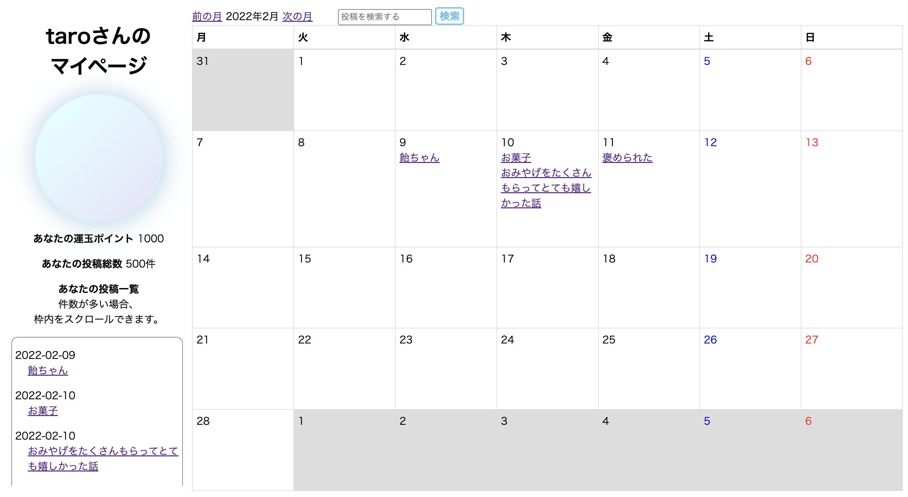

# アプリケーション名
運玉

# アプリケーション概要
その日あった幸運な出来事を日記として記録するアプリケーションです。幸運な出来事は「大大吉」「大吉」「吉」の三つの幸福度合いが設定できて、それぞれ異なるポイントが貯まるようになっています。このアプリは運玉育成アプリであり、ひとりひとり幸運の種である「運玉」を持っています。ポイントが貯まっていくと、マイページで自らの運玉がどんどん大きくなっていく様子が可視化されます。

 

# 利用方法
## 出来事の投稿
1.トップページのサイドバーからユーザー登録を行います 
2.トップページの「出来事を記録する」ボタンから、投稿内容（タイトル・内容・日にち・レベル・公開/非公開）を入力し、投稿します 
3.出来事は後から編集・削除することができます 

## 出来事の確認
1.投稿内容の確認はカレンダー内の当該出来事のタイトルをクリックします 
2.カレンダー上部の検索バーから検索することもできます 

# 実装予定の機能
・「いいね機能」で利用者間の双方向性を高めます 
・「タグ機能」「検索オプション機能」で利用者の利便性向上を図ります 
・「記念日ポイント機能」として、誕生日と記念日を登録できるようにし、記念日ごとに100ポイント付与する機能を実装し、利用者の満足度向上に努めます 

# テーブル設計
## users テーブル

| Column             | Type   | Options                   |
| ------------------ | ------ | ------------------------- |
| name               | string | null: false               |
| email              | string | null: false, unique: true |
| encrypted_password | string | null: false               |

### Association

- has_many :events

## events テーブル

| Column         | Type       | Options                        |
| -------------- | ---------- | ------------------------------ |
| title          | string     | null: false                    |
| text           | text       | null: false                    |
| happy_level_id | integer    | null: false                    |
| public_id      | integer    | null: false                    |
| day            | date       | null: false                    |
| user           | references | null: false, foreign_key: true |

### Association

- belong_to :user

# 参考文献
桜井識子『運玉』（幻冬舎文庫）
